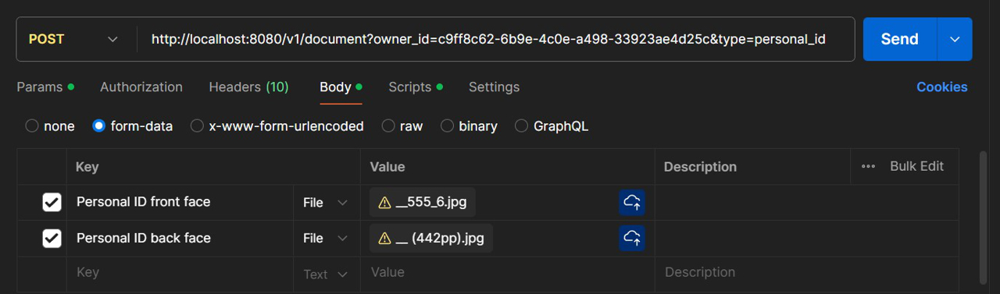

## Uploading Documents

### Endpoint
`POST /{owner_id?}/{group_id?}/{type?}/{cipher?}`

### Process
1. **Client Request**:
    - The client uploads 1 or more document by sending a multipart form data request to the server
      with optional url query parameters: `owner_id`, `group_id`, `type`, and `cipher`.

2. **Parameter Parsing**:
    - The server parses the query parameters from the URL:
       - `owner_id`: ID of the document owner. (Mandatory)
       - `group_id`: ID of the group to associate the document with. (Optional)
        - `type`: Type of the document. (Mandatory)
        - `cipher`: Boolean indicating whether the document should be encrypted. (Optional, default: `true`)

   - Note all document types must be defined in the [DocumentType](../kdoc-system/database/src/main/kotlin/kdoc/database/schema/document/type/DocumentType.kt) enum:

3. **Receive Multipart Data**:
    - The server receives the multipart data from the client's request.

4. **Server Audit**:
    - The server audits the document upload operation.

5. **Document Upload**:
    - The server uploads each of the documents to storage, encrypting them if necessary.
    - The server creates a document reference in the database for each uploaded document.
    - If any of the documents fail to upload, the server rolls back the operation and responds with an error.

6. **Server Response**:
    - If the upload is successful, the server responds with a `201 Created` status and the details of the created documents.
    - If the upload fails, the server responds with a `400 Bad Request` status and an error message.

### Example Request (Postman)

