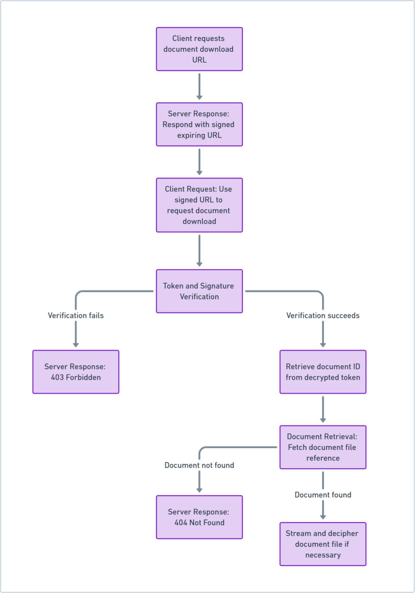
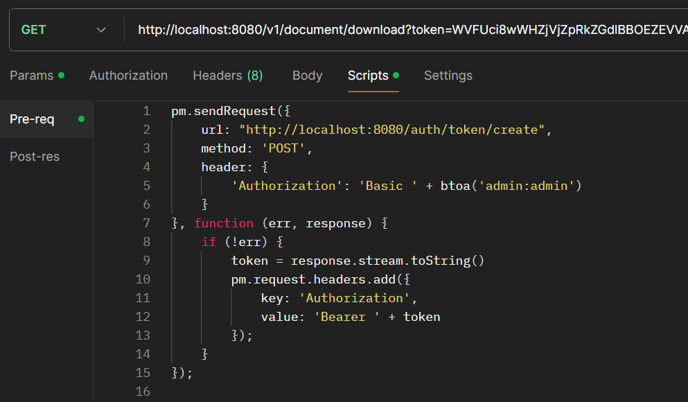

## Downloading Documents

### Generate a Signed URL

#### Endpoint
`GET /{document_id}/url`

#### Process
1. **Client Request**:
    - The client requests a signed URL by providing the document's Id (`document_id`),
      or the group's Id (`group_id`) to download all documents associated with a group.

2. **Server Audit**:
   - The server audits the request for generating a signed URL.

3. **URL Generation**:
   - The server creates a signed, expiring URL.
   - This URL includes an encrypted token and a signature.

4. **Server Response**:
   - The server responds with the signed URL.

#### Example Response
```
https://server.com/download?token=<encryptedToken>&signature=<hmacSignature>
```

---
### Download the Document with the Signed URL

#### Endpoint
`GET /download/{token}/{signature}`

#### Process

1. **Client Request**:
   - The client uses the signed URL to request the document(s) download.

2. **Server Audit**:
    - The server audits the download request.

3. **Token and Signature Verification**:
    - The server verifies the token and signature.
    - If verification fails (invalid or expired token):
        - The server audits a log of the failed attempt.
        - The server responds with a `403 Forbidden` status.
    - If verification succeeds:
       - The server retrieves the document ID (or group ID) from the decrypted token.

4. **Document Retrieval**:
   - The server fetches the document file(s) reference using the document ID (or group ID if applicable).
    - If the document is not found, the server responds with a `404 Not Found` status.

5. **File Streaming**:
   - If the document(s) is found, the server prepares to stream the document file to the client.
    - The server sets the appropriate response headers to indicate a file download.
    - The server streams the document file, deciphering it if necessary.



---
### Authentication

If user authentication is required, the server can enforce credentials checks before any action is taken.

See [Security Configuration Settings](../kdoc-base/src/main/resources/config/config_security.conf)

For convenience all the provided postman endpoints are configured to automatically authenticate the user.
When testing the download signed URL, you will need to include the auto-authentication script as seen in the following screenshot:



```
pm.sendRequest({
    url: "http://localhost:8080/auth/token/create",
    method: 'POST',
    header: {
        'Authorization': 'Basic ' + btoa('admin:admin')
    }
}, function (err, response) {
    if (!err) {
        token = response.stream.toString()
        pm.request.headers.add({
            key: 'Authorization',
            value: 'Bearer ' + token
        });
    }
});
```
