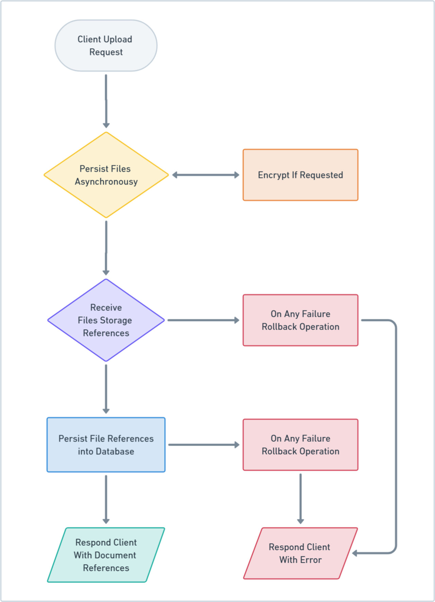

# Document Persistence Flow

### Receiving Files
- **Process**:
    - The server receives a multipart form data request.
    - Each part of the multipart data is processed asynchronously.

---
### Persisting Files
- **Process**:
    - For each `FileItem` part in the multipart data:
        - The server retrieves the original filename.
        - A new filename is generated based on the source properties.
        - The file is physically stored on disk in a structured directory format based on the current date.
        - The directory structure is organized as `uploadsRoot/year/month/day/filename`.
        - If encryption is enabled (`cipher` is true), the both the filename and its contents are encrypted during the storage process.
        - A `Response` object is created containing details about the stored file.
        - The responses are saved into the database.
        - A list of references are returned to the caller.

---
### Filename Construction Steps

1. **Generate Path**:
    - Use current UTC dat for the folder structure: `YYYY/MM/DD`.

2. **Generate Snowflake ID**:
    - Ensure unique filenames and identify the file producer.

3. **Compose Filename**:
    - Concatenate with `~` delimiter:
      ```
      snowflakeId~ownerId~type~groupId~originalFileName
      ```

4. **Encrypt (if enabled)**:
    - Encrypt the composed filename using AES encryption.
   
5. **Return**:
    - Return the full path with filename: `path/encryptedFilename` or `path/newFilename`.
     
---
### Handling Errors
- **Process**:
    - If an error occurs during the file storage process:
        - The error is logged.
        - All partially stored files are deleted to maintain consistency.

---
### Global Cipher / Decipher of Existing Files
And endpoint is provided to encrypt and decrypt all files. This action effectively changes the contents of the files and their filenames.
Files which are already in the requested new ciphered state will remain unchanged.
This can be used to re-encrypt files with a new key or to decrypt all files.
```
http://localhost:8080/v1/document/cipher/{true or false}
```

---
### Upload Flow
